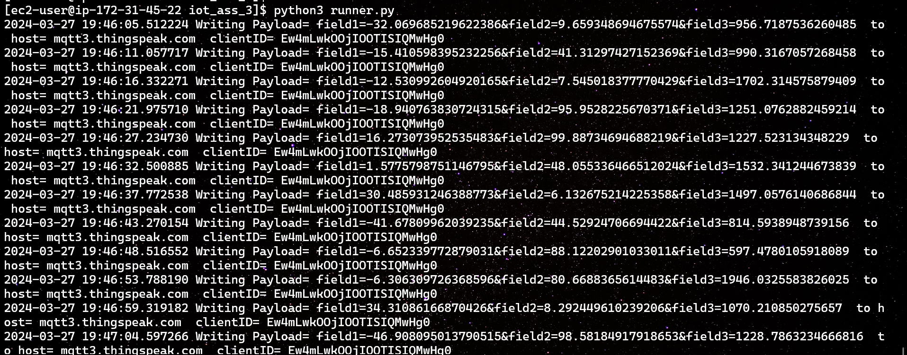
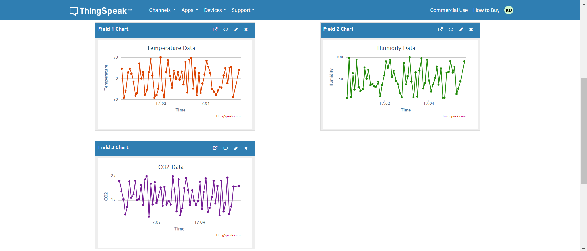

## IOT Device simulation to publish data to Thingspeak MQTT Broker

- `virtual_iot_station.py` is a helper file to generate random sensor values. Currently I've included temperature, humidity and CO2 levels

- `runner.py` is the file responsible to connect, get data from virtual iot station and publish to thingspeak mqtt broker.

- I am running `runner.py` as a process on an EC2 instance on AWS.

- Thingspeak dashboard after some data has been populated

